# Prodigal

Music Player APP looks and feels like a classic device.

Bring back the good old player to life.

### Screen Record

### Screenshots

| 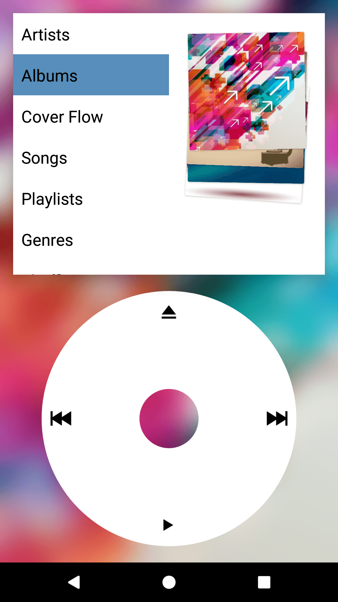         | 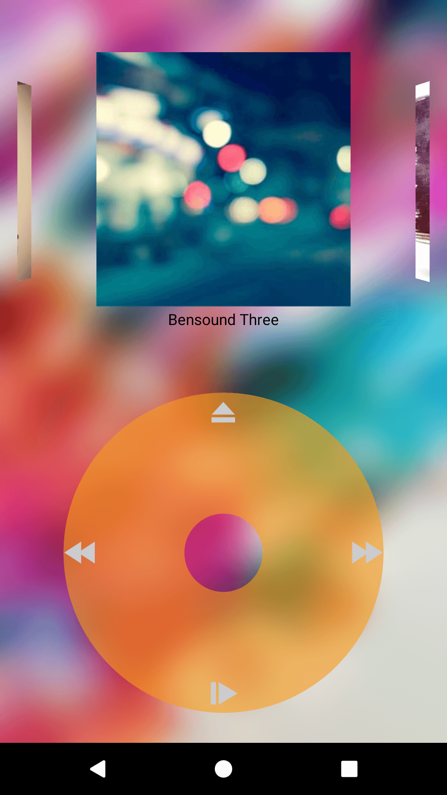   | 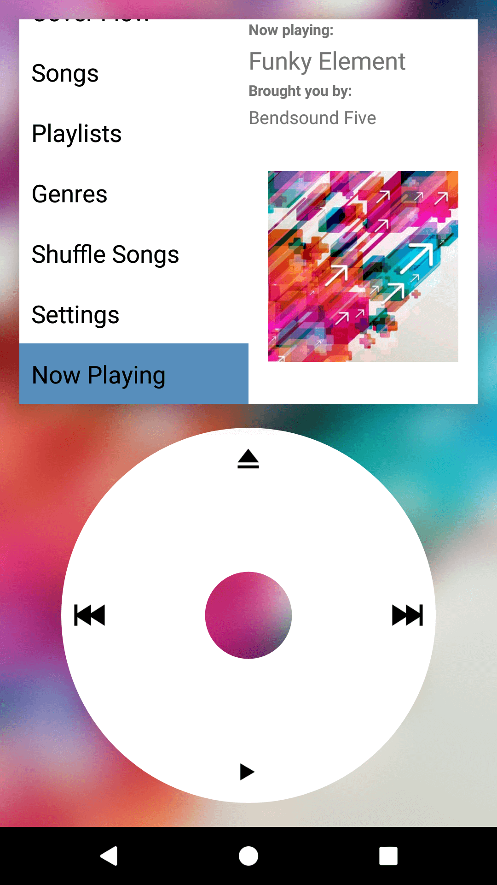      | 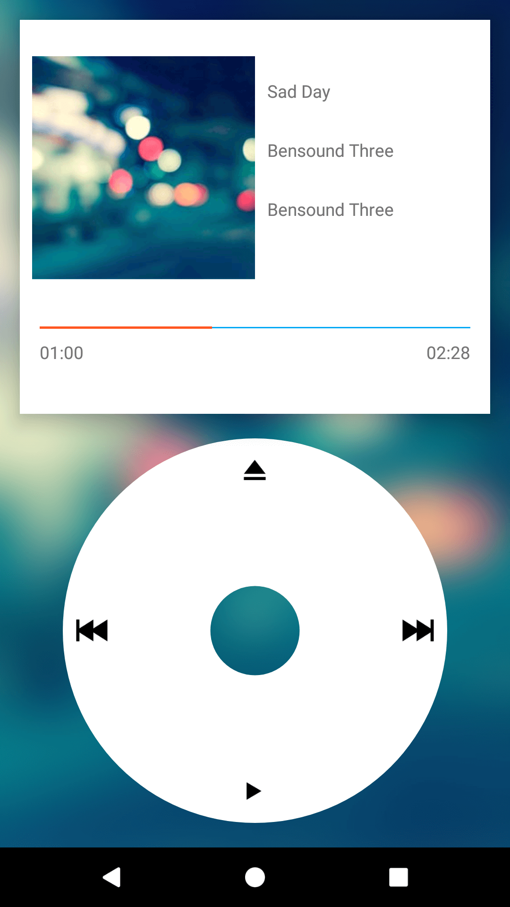       |
| ---------------------------------------- | ---------------------------------- | ----------------------------------- | -------------------------------------- |
| Home page                                | Browse Cover                       | Now playing widget                  | Now playing page                       |
| 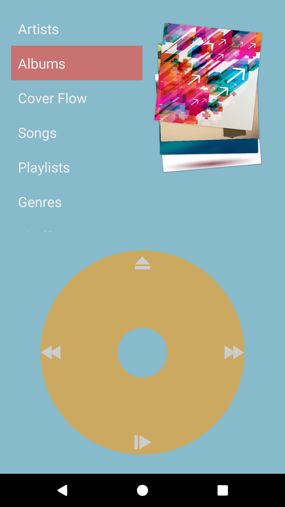 | 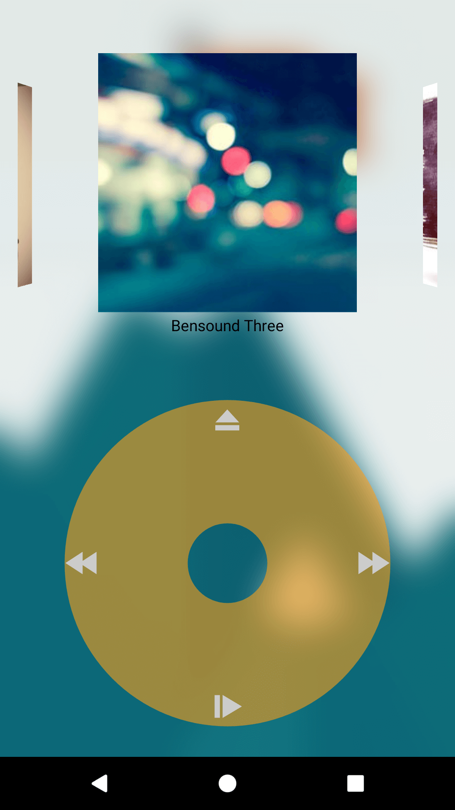 | 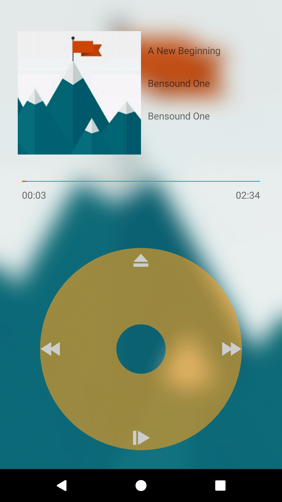 | 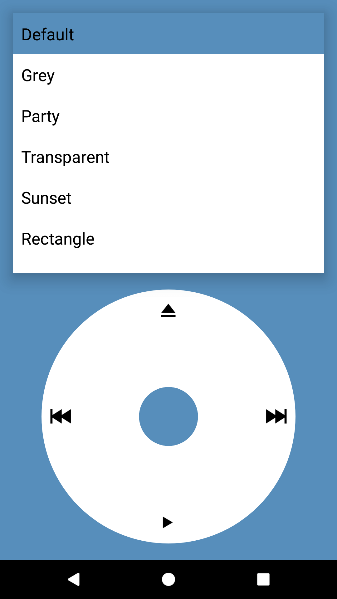     |
| Home page                                | Browse Cover                       | Now playing page                    | Theme 'default'                        |
|           | 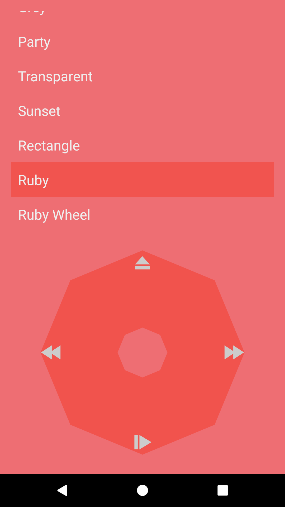    | 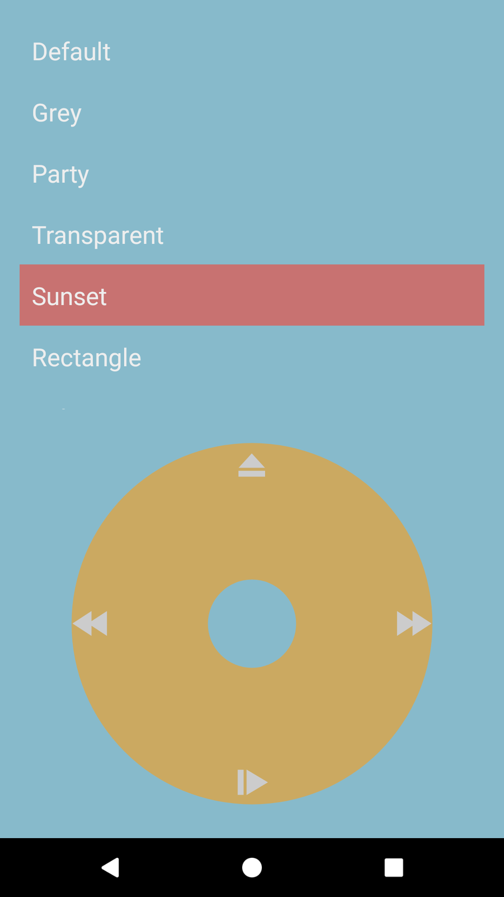   | 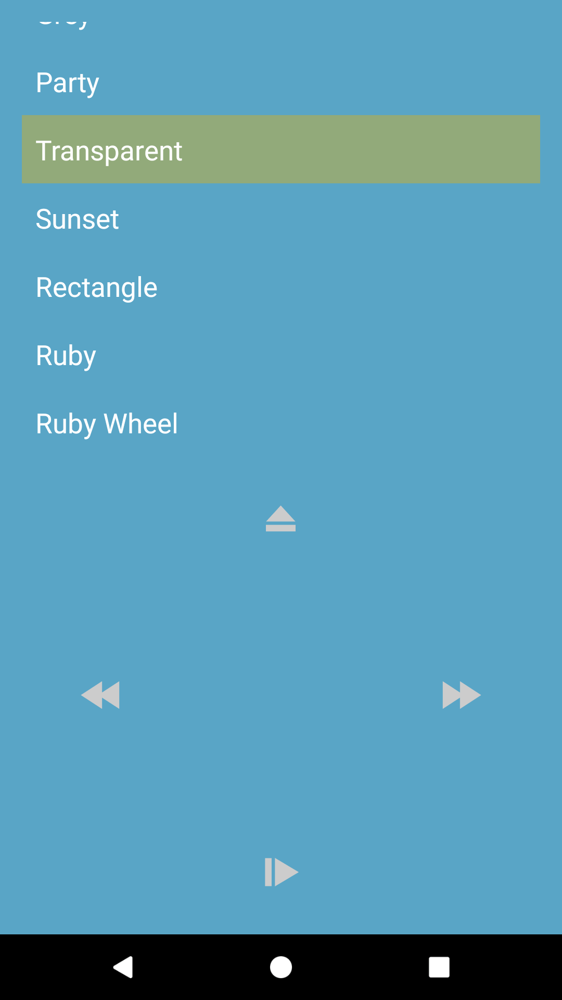 |
| Theme 'grey'                             | Theme 'ruby'                       | Theme 'sunset'                      | Theme 'transparent'                    |

### Customizing Themes

See this [link](https://github.com/SpongeBobSun/Prodigal/blob/master/Themes.md) for customizing themes.

### Building

To build Prodigal for Android you need import the project in AndroidStudio.

Before you hit the run or debug button, you may need to run the `zipThemes` gradle task, which will zip the theme folder and copy it to `assets` folder.

After themes are zipped as assets, you can switch to the `app` configuration and hit the run button.

### Credits

Icons in this app are brought you by [Icons8.com](https://icons8.com)

[Picasso](https://github.com/square/picasso)

[SwipeStack](https://github.com/flschweiger/SwipeStack)

[Grant](https://github.com/anthonycr/Grant)

[NumberProgressBar](https://github.com/daimajia/NumberProgressBar)

[Android-Coverflow](https://github.com/crosswall/Android-Coverflow)

[Material-Intro](https://github.com/HeinrichReimer/material-intro)

### Pillar of Shame

You can take my source & add ADs to it then pretent it's your own APP but this is NOT cool.

If you want to do it anyway, you MUST distribute a copy of Apache license and copyright notice along with your software.

Or I WILL add your work to this pillar of shame.

[Eyepod](https://play.google.com/store/apps/details?id=com.free.musicplayer.eyepod)

