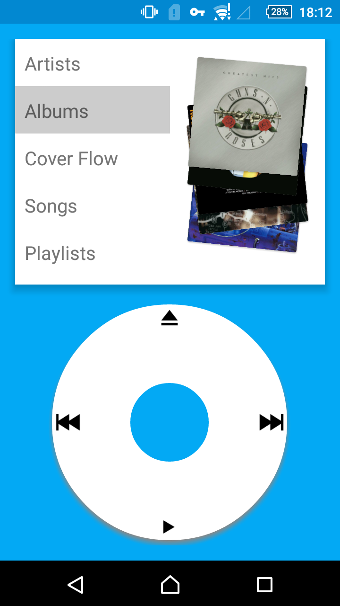
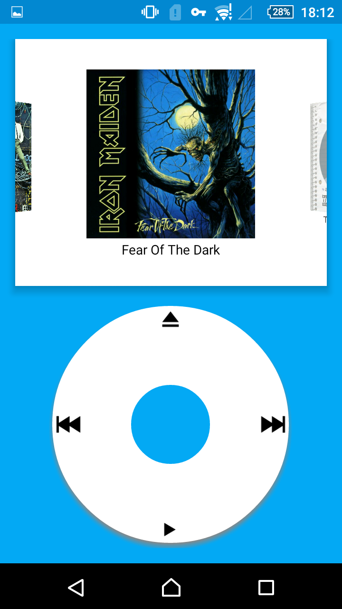
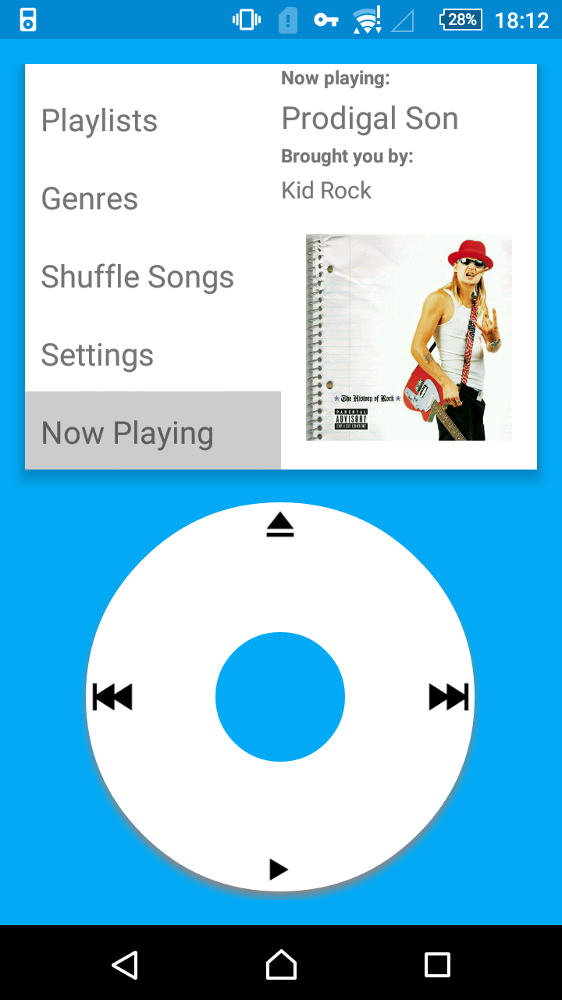
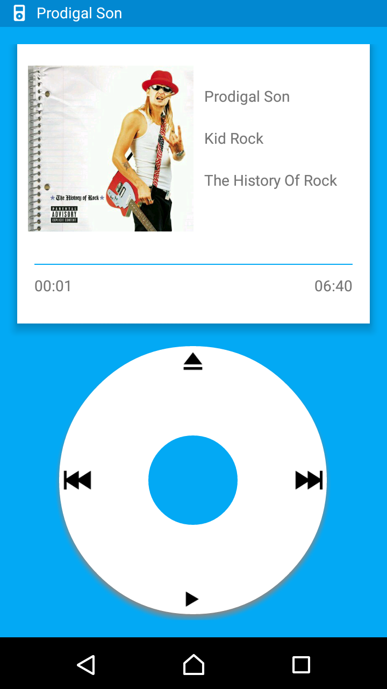

# Prodigal

Music Player APP looks and feels like a classic device.

Bring back the good old player to life.

###Screen Record

###Screenshots

|  |  |  |  |
| -------------------------- | ---------------------------- | ---------------------------- | ------------------------------- |
|                            |                              |                              |                                 |

###Notice

PLEASE DO NOT TAKE MY SOURCE CODE AND MAKE COPY CAT APPs of Prodigal Music Player!

I'm talking about you - owner of [this app](https://play.google.com/store/apps/details?id=com.uzbiapp.audioplayer).
Since you don't reply any of my emails, you can go %#@& yourself.

###Credits

Icons in this app are brought you by [Icons8.com](https://icons8.com)

[Picasso](https://github.com/square/picasso)

[SwipeStack](https://github.com/flschweiger/SwipeStack)

[Grant](https://github.com/anthonycr/Grant)

[NumberProgressBar](https://github.com/daimajia/NumberProgressBar)

[Android-Coverflow](https://github.com/crosswall/Android-Coverflow)

[Material-Intro](https://github.com/HeinrichReimer/material-intro)
